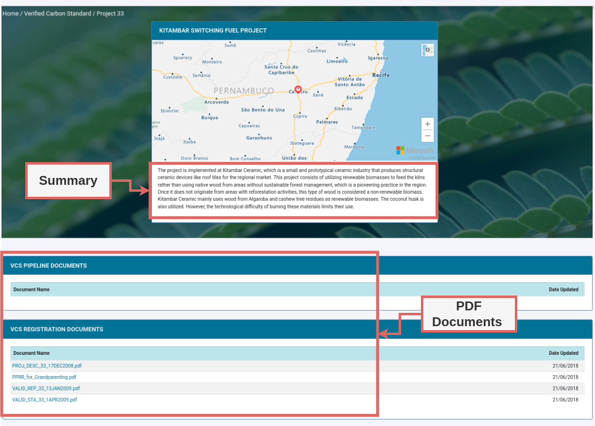

# Verra VCS Document Scraper

## Table of Contents

- [Verra VCS Document Scraper](#verra-vcs-document-scraper)
  - [Table of Contents](#table-of-contents)
  - [About ](#about-)
  - [Features](#features)
  - [Getting Started](#getting-started)
    - [Installation](#installation)
  - [Usage](#usage)
    - [Quick Start](#quick-start)
    - [Output](#output)

## About <a name = "about"></a>

This project facilitates the extraction of document data from the Verra Verified Carbon Standard (VCS) Registry, an open database widely utilized by carbon credit traders. Leveraging Python, it offers a user-friendly interface for efficient data scraping, including summary data, metadata, and PDF documents from detailed VCS pages.

Explore the Verra VCS Registry: [Verra VCS Registry](https://registry.verra.org/app/search/VCS)

## Features
- **Automated Scraping**: Effortlessly retrieves summary data, metadata, and direct PDF document links.
- **User-Friendly**: Simple command-line interface for easy operation.
- **Flexible**: Options to customize the scraping process according to your needs.

## Getting Started

### Installation


1. **Prerequisites**: Ensure you have Taskfile installed on your system as a prerequisite. [Taskfile](https://taskfile.dev) is a task runner / build tool that simplifies the execution of predefined tasks within a project.

2. **Set Up Environment**: To configure your environment and install all necessary dependencies, execute the following command:

    ```bash
    task req-install
    ```

## Usage

### Quick Start

1. **Launch the Scraper**: Start scraping by running the main script.

   ```bash
   python3 src/main.py
   ```

   This initiates the scraping of both summary data and PDF document links.

2. **Customize Your Scraping**:

   - To scrape only the summary data, use:

     ```bash
     python3 src/main.py --disable-document
     ```

   - To obtain only PDF links, run:

     ```bash
     python3 src/main.py --disable-summary
     ```


### Output

The scraper categorizes the data into two main types: Summary Data and PDF Links.

- **Summary Data**: Extracted summary information is saved in `.txt` format in the `results/summary` directory. For instance, data for project ID 33 will be stored in `33.txt`.

- **PDF Links**: Links to PDF documents, along with metadata such as the last update date and file names, are compiled into a CSV file named `pdf_links.csv` located in the `results/` directory. Access or download the documents directly via these links.

To better understand what parts of the webpage are scraped for summary data and where the PDF documents are located, refer to the image below:



This image illustrates the specific sections of the Verra VCS Registry that the scraper targets for data extraction. The highlighted areas show where the summary information is located and which parts contain links to PDF documents.


---
